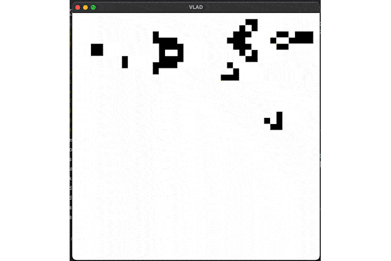

# CONWAY'S GAME OF LIFE on C

### My realization of the life game on C and vladlib (my own wrap over OpenGL)



## MacOS or Linux
```
git clone https://github.com/Klematisy/life.git
cd life
```

To run the game you will need to compile vladlib by using cmake at vladlib source directory:
```
cd src/vladlib
cmake -S . -B build
cmake --build build --parallel
```

### Linux:
Then go to the main directory and open CMakeLists.txt.
At the end of 9 line of the cmake code you need to change "dylib" on "so"

```
cmake -S . -B build
cmake --build build --parallel
build/life
```

### MacOS
Just run the CMakeLists.txt

```
cmake -S . -B build
cmake --build build --parallel
build/life
```

### Controls

"+"   - increase frequency of iterations\
"-"   - decrease frequency of iterations\
SPACE - start/stop life

left mouse button - fill a cell\
escape - quit!\